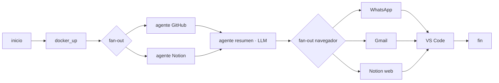

# Tentacool

**El copiloto agéntico de tu jornada.** Un grafo de agentes en paralelo
(LangGraph) que arranca tu día: junta contexto de tus repos y de Notion,
genera un briefing, abre tus herramientas, y mantiene tu memoria viva —
todo orquestado con LangGraph + Golang.

[](https://github.com/Amadosixteen/Tentacool/actions/workflows/tests.yml)


---

## WORKFLOW

- **Multiagente real, no un script secuencial** — LangGraph orquesta un
  grafo donde varios agentes (GitHub, Notion, navegador...) corren **en
  paralelo** vía fan-out dinámico (`Send()`), y convergen en un supervisor
  que fusiona el estado.
- **Go para el trabajo pesado** — el I/O concurrente (descubrir repos,
  traer commits, levantar contenedores Docker) corre en un CLI propio escrito en
  Go (`tentacool-io`, goroutines, solo stdlib), que le entrega a la IA
  JSON limpio en vez de texto crudo: menos tokens, menos ruido, menos
  latencia. Si no está compilado, cae a un fallback en Python.
- **MCP nativo** — la memoria de Notion queda expuesta como herramientas:
  los agentes gestionan la base de datos sin copiar y pegar
  contexto entre apps. Dos canales separados: **Memoria** (jornada:
  reportes y pendientes) y **Anotaciones** (recursos del día a día, cada
  entrada sellada con día, hora exacta y proyecto de origen).
- **Historial que no se te va de las manos** — todo se guarda en bases de
  datos de Notion con propiedades `Fecha`, `Tipo` y `Origen`, así que a los
  seis meses sigues encontrando lo de julio: filtras `Desde → Hasta` desde
  la propia interfaz de Notion, o le pides el rango a la IA
  (`main.py leer --desde 2026-07-01 --hasta 2026-07-31`).
- **Cualquier LLM, tu propia key** — compatible con la API de OpenAI y
  equivalentes (DeepSeek por defecto). Pensado para orquestar varias claves,
  proveedores, modelos, entornos Docker y hasta varias cuentas de Notion o
  Gmail.
- **Libre** — código abierto, cada integración es un nodo aislado. Sin
  GitHub/Notion/Docker configurados, esos nodos se omiten solos y el resto
  sigue funcionando. Lo moldeas a tu jornada, no al revés.

---

## Compatibilidad

**Corre en Linux nativo**, cualquier distribución. La automatización
central (disparo por horario, apertura de apps del escritorio) se apoya en
`cron` y en convenciones de escritorio que solo existen en Linux.

- **WSL2**: funciona para todo lo manual (`inicio`, `fin`, `leer`, `nota`,
  `pendiente`). El disparo automático por `cron` no se recomienda: rinde
  alrededor del 20% de su potencial.
- **macOS / Windows nativo**: no soportado tal cual hoy. Para macOS hay un
  proyecto aparte, *TentaCoolMACIntegration*, con otra filosofía.

---

## INICIAR

```bash
git clone <tu-repo> tentacool && cd tentacool
bash setup.sh               # crea .venv, instala deps, genera .env y .mcp.json
nano .env                   # rellena tus claves (todas opcionales)
./.venv/bin/python main.py inicio    # prueba la rutina de la mañana
```

Con Notion configurado, un paso más para tener el historial filtrable por
fechas (crea una base de datos dentro de cada página y pasa a filas lo que
ya tuvieras escrito; las páginas no se tocan):

```bash
./.venv/bin/python main.py crear-bases      # imprime los IDs para el .env
./.venv/bin/python main.py migrar --dry-run # revisar antes de escribir
./.venv/bin/python main.py migrar
./.venv/bin/python main.py fijar-base       # deja la tabla arriba de la página
```

Cada entrada queda como fila con `Contenido` (título), `Descripción` (el
texto completo, visible sin abrir la fila), `Fecha`, `Tipo`, `Origen` y
`Hecho`.

La única clave con la que vale la pena empezar es `LLM_API_KEY` (o
`DEEPSEEK_API_KEY`). Todo lo demás — Notion, GitHub, Docker, MCP, tu
horario por cron — está documentado y explicado en `.env.example` y
`CLAUDE.md` (si usas Claude para construir/moldear encima); la estructura
del código (`src/nodes.py`, un nodo por integración) se explica sola.

---

## Comandos

```bash
python main.py inicio        # rutina de la mañana (manual o por cron)
python main.py fin           # cierre: apaga los contenedores Docker
```

**Memoria** — la jornada: lo hecho y lo pendiente.

```bash
python main.py leer                       # lo reciente
python main.py leer --desde 2026-07-01 --hasta 2026-07-31
python main.py nota "resumen de lo hecho..."
python main.py pendiente "falta desplegar..."   # queda como checkbox
```

**Anotaciones** — el día a día: enlaces, credenciales, cosas a mano. Cada
entrada guarda el proyecto desde el que se escribió, así que conviene
lanzarlo desde la carpeta en la que estés trabajando.

```bash
python main.py anotacion "panel del ERP: https://... usuario admin"
python main.py anotaciones
python main.py anotaciones --desde ayer
```

**Puesta a punto de Notion** (una sola vez):

```bash
python main.py crear-bases   # crea las bases y muestra los IDs para el .env
python main.py migrar        # pasa a filas lo ya escrito (--dry-run para ver)
python main.py fijar-base    # deja la tabla arriba de la página
```

Las fechas admiten `AAAA-MM-DD`, `DD/MM/AAAA`, `hoy` y `ayer`. `--hasta`
incluye el día entero.

---

## Herramientas MCP

El proyecto expone un servidor MCP (`src/mcp_server.py`), registrado solo
con que exista `.mcp.json` en la raíz — `setup.sh` lo genera. Desde Claude
Code (o cualquier cliente MCP) puedes pedir las cosas en lenguaje normal y
el agente llama a estas herramientas:

| Herramienta | Qué hace |
|---|---|
| `notion_leer_memoria(desde, hasta)` | Lee la jornada, opcionalmente por rango |
| `notion_escribir_reporte(texto)` | Añade un resumen de lo hecho |
| `notion_escribir_pendiente(texto)` | Añade un pendiente (checkbox) |
| `notion_leer_anotaciones(desde, hasta)` | Lee los recursos del día a día |
| `notion_escribir_anotacion(texto, proyecto)` | Guarda un recurso, con fecha y origen |

---

## Arquitectura



| Ruta | Propósito |
|---|---|
| `main.py` | CLI: todos los comandos de arriba |
| `src/graph.py` | Construcción de los grafos LangGraph (`inicio` y `fin`) |
| `src/nodes.py` | Los agentes: GitHub, Notion, navegador, resumen, Docker, VS Code |
| `src/notion_db.py` | Bases de datos de Notion: crear, escribir filas, consultar por rango |
| `src/migracion.py` | Paso de bloques a filas, sin tocar la página original |
| `src/mcp_server.py` | Servidor MCP |
| `src/config.py` | Configuración: todo por variables de entorno |
| `tentacool-io/` | CLI en Go: I/O concurrente (commits, Docker) → JSON limpio |

Añadir una integración es escribir una función que devuelva un dict parcial
en `src/nodes.py` y conectarla en `src/graph.py`.

---

## Desarrollo

```bash
pip install -r requirements-dev.txt
pytest                            # sin tocar Notion ni la red
cd tentacool-io && go build ./... && go vet ./...
```

Los tests no leen tu `.env` ni necesitan credenciales: si alguno empieza a
necesitarlas, es el test el que está mal.

---
## Seguridad

`.env` y `.mcp.json` están en `.gitignore` — nunca se suben a git. Tus
tokens y tu página de Notion son tuyos y nunca salen de tu máquina.

La página **Anotaciones** (donde van credenciales y recursos privados) es
de **escritura ciega** para el orquestador: no se lee en la rutina de la
mañana ni entra en el prompt del LLM. Solo se consulta bajo petición
explícita, por CLI o por MCP.

---

Licencia MIT — ver [`LICENSE`](LICENSE).
