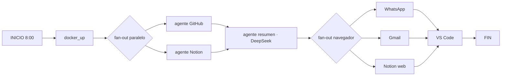

# Tentacool — Inicio de Jornada

Orquestador **multiagente** que automatiza el inicio de la jornada laboral
de un desarrollador: recoge contexto del día, genera un briefing inteligente,
abre las herramientas de trabajo y deja la memoria escrita para el día siguiente.

> Tecnologías: **LangGraph** (orquestación de agentes) · **DeepSeek** (LLM) ·
> **Notion API** (memoria persistente) · **MCP** (integración con Claude Code) ·
> Docker · GitHub API

---

## 🚀 Quickstart (para nuevos usuarios)

```bash
git clone <tu-repo> tentacool && cd tentacool
bash setup.sh               # crea .venv, instala deps y genera .env
nano .env                   # rellena tus claves (todas opcionales)
./.venv/bin/python main.py inicio    # prueba la rutina de la mañana
./.venv/bin/python main.py leer      # lee tu página de Notion
```

El sistema es **configurable por entorno**: sin GitHub/Notion/Docker, los nodos
correspondientes se omiten con un aviso y el resto funciona igual. La única clave
con la que vale la pena empezar es `LLM_API_KEY` (o `DEEPSEEK_API_KEY`).

---

## 🎯 Propósito

Cada mañana a las **8:00** (programado con cron), el orquestador:

1. **Descubre tus repos de GitHub** (dinámicos) y resume los **últimos commits desde ayer**.
2. **Lee tu página "Memoria" de Notion** → el contexto del día anterior
   (lo avanzado, lo pendiente, lo que sigue).
3. **DeepSeek genera un briefing** con todo ese contexto y **lo escribe en Notion**
   (así la memoria se alimenta sola día tras día).
4. **Abre en tu navegador (Brave)**: WhatsApp, Gmail y tu página de Notion.
5. **Abre VS Code** en tu proyecto del día.
6. Al final de la jornada: `fin` **apaga los contenedores Docker** (sin apagar
   la PC, que queda disponible para acceso remoto).

---

## 🧠 Arquitectura multiagente (LangGraph)

El orquestador es un **grafo supervisor** (`StateGraph`) donde varios "agentes"
trabajan en **paralelo** y convergen en un resumen:



- **Supervisor** = el grafo central que decide el flujo y fusiona el estado.
- **Agentes worker** = nodos especializados (GitHub, Notion, navegador), ejecutados
  en paralelo con `Send()` (fan-out dinámico).
- **Agente LLM** = DeepSeek convierte el contexto crudo en un briefing accionable.
- **Memoria compartida** = el estado del grafo transporta el contexto entre nodos.

### Dos grafos
| Grafo | Cuándo | Qué hace |
|---|---|---|
| `inicio` | 8:00 (cron) / manual | Rutina completa de la mañana |
| `fin` | Al irte | Apaga los contenedores Docker |

---

## 🔌 Integración MCP (Claude Code → Notion)

El proyecto expone un **servidor MCP** que convierte tu página "Memoria" de Notion
en **herramientas** que Claude Code puede llamar de forma nativa:

| Herramienta MCP | Función |
|---|---|
| `notion_leer_memoria` | Lee el contexto actual de la página |
| `notion_escribir_pendiente` | Añade pendientes como checklists `[ ]` |
| `notion_escribir_reporte` | Añade resúmenes/párrafos de lo hecho |

**Flujo de uso con Claude Code**: a las ~16:00 le dices *"escribe en mi Notion
todo lo que hicimos y lo pendiente"* y la IA lee la memoria, resume y escribe sola
(guiado por `CLAUDE.md`). La conexión se detecta automáticamente vía `.mcp.json`.

Hay una **alternativa por terminal** (sin MCP) que funciona con cualquier agente:
`python main.py nota "..."`, `python main.py pendiente "..."`, `python main.py leer`.

---

## 📦 Estructura funcional

| Ruta | Propósito |
|---|---|
| `main.py` | CLI: `inicio`, `fin`, `leer`, `nota`, `pendiente` |
| `src/graph.py` | Construcción de los grafos LangGraph (inicio y fin) |
| `src/nodes.py` | Los agentes/nodos (GitHub, Notion, navegador, resumen, Docker, VS Code) |
| `src/mcp_server.py` | Servidor MCP para Claude Code |
| `src/config.py` | Configuración (tokens, rutas, navegador, proyectos) |
| `.env` | Credenciales (NUNCA subir a git) |
| `.mcp.json` | Registro del servidor MCP para Claude Code |
| `CLAUDE.md` | Reglas para que la IA use las herramientas de Notion |

---

## 🚀 Uso

```bash
source .venv/bin/activate

python main.py inicio       # rutina de la mañana (o la dispara cron a las 8:00)
python main.py fin          # apaga contenedores al irte
python main.py leer         # ver la memoria de Notion
python main.py nota "..."   # escribir un reporte en Notion
python main.py pendiente "..."  # añadir un pendiente en Notion
```

Programación automática (cron): la rutina `inicio` corre **todos los días a las 8:00**
y deja su salida en `cron-inicio.log`.

---

## ⚙️ Configuración

Todo se configura con variables de entorno (`.env`), ninguna clave está en el
código. Plantilla: `.env.example` → cópiala a `.env`.

| Variable | Uso | Requerida |
|---|---|---|
| `LLM_API_KEY` / `DEEPSEEK_API_KEY` | Clave del LLM (briefing) | para el resumen |
| `LLM_BASE_URL` / `LLM_MODEL` | Proveedor y modelo (default: DeepSeek) | opcional |
| `GITHUB_TOKEN` / `GITHUB_USER` | Descubrir repos + commits desde ayer | para GitHub |
| `NOTION_TOKEN` | Escribir/leer la página "Memoria" | para Notion |
| `NOTION_DATABASE_ID` / `NOTION_PAGE_URL` | Página de Notion | para Notion |
| `BROWSER_CMD` / `BROWSER_PROFILE` | Navegador (default: Brave) | para abrir pestañas |
| `WHATSAPP_URL` / `GMAIL_URL` | URLs a abrir | opcional |
| `PROJECTS_DIR` / `PROJECTS_DOCKER` | Proyectos con docker-compose | para Docker |
| `VSCODE_PROJECT` | Proyecto a abrir en VS Code | para VS Code |
| `DOCKER_ENABLED` / `BROWSER_ENABLED` / `VSCODE_ENABLED` | Feature flags | opcional |

### Personalización del código
- **Nodos / agentes**: `src/nodes.py` — añadir una integración nueva es añadir
  una función que devuelve un dict parcial y conectarla en `src/graph.py`.
- **Horario**: `crontab -e` (ej. `0 8 * * 1-5 ...` = lun-vie a las 8:00).

### 🔒 Seguridad
- `.env` está en `.gitignore` — nunca se sube a git.
- Los tokens y la página de Notion son **tuyos** y no salen del repo.
